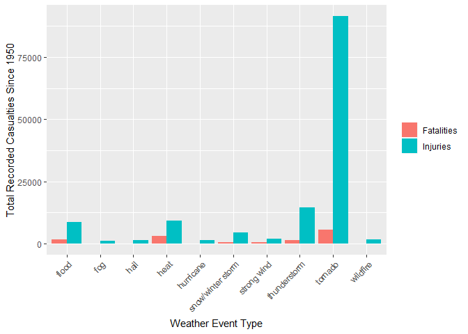
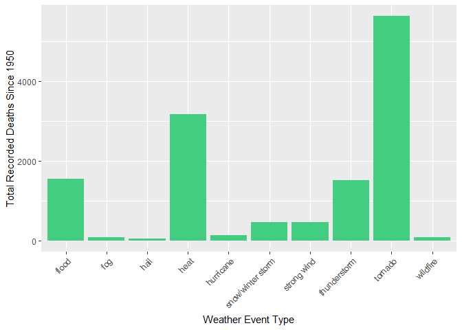
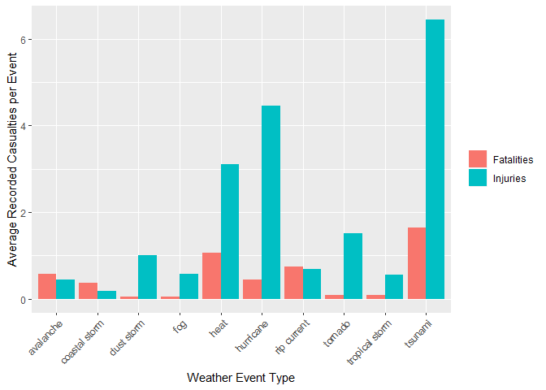
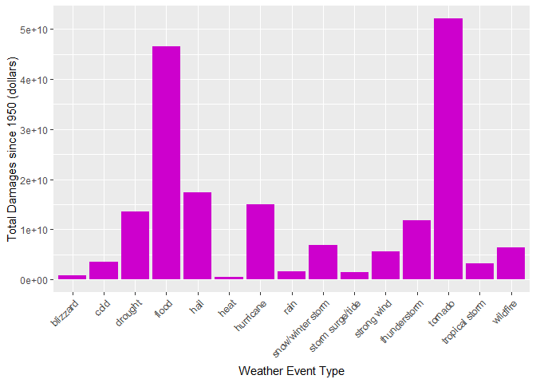
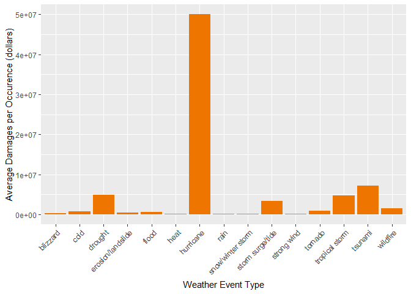

## Synopsis
In this article we seek to assess which weather events are most damaging in the United States. We performed our analysis on two types of damage: human population damage, comprising of fatalities and injuries, and economic damage, comprising of the estimated cost of damage to crops and property. To carry out our analysis we utilized NOAA's storm database, which has tracked weather events and their consequences since 1970.  

We conclude that tornadoes and tsunamis cause the most casualties, while tornadoes, floods, and hurricanes cause the most costly damage. 


## Data Preparation

In order to carry out analysis, we first need to prepare the data. The data used in this report is from NOAA's storm database and can be found at:
```https://d396qusza40orc.cloudfront.net/repdata%2Fdata%2FStormData.csv.bz2```

First we read in the data file and look at its structure. 

```r
file <- "data/repdata_data_StormData.csv.bz2"
rawData <- read.csv(file, header = TRUE)
str(rawData)
```

```
## 'data.frame':	902297 obs. of  37 variables:
##  $ STATE__   : num  1 1 1 1 1 1 1 1 1 1 ...
##  $ BGN_DATE  : Factor w/ 16335 levels "1/1/1966 0:00:00",..: 6523 6523 4242 11116 2224 2224 2260 383 3980 3980 ...
##  $ BGN_TIME  : Factor w/ 3608 levels "00:00:00 AM",..: 272 287 2705 1683 2584 3186 242 1683 3186 3186 ...
##  $ TIME_ZONE : Factor w/ 22 levels "ADT","AKS","AST",..: 7 7 7 7 7 7 7 7 7 7 ...
##  $ COUNTY    : num  97 3 57 89 43 77 9 123 125 57 ...
##  $ COUNTYNAME: Factor w/ 29601 levels "","5NM E OF MACKINAC BRIDGE TO PRESQUE ISLE LT MI",..: 13513 1873 4598 10592 4372 10094 1973 23873 24418 4598 ...
##  $ STATE     : Factor w/ 72 levels "AK","AL","AM",..: 2 2 2 2 2 2 2 2 2 2 ...
##  $ EVTYPE    : Factor w/ 985 levels "   HIGH SURF ADVISORY",..: 834 834 834 834 834 834 834 834 834 834 ...
##  $ BGN_RANGE : num  0 0 0 0 0 0 0 0 0 0 ...
##  $ BGN_AZI   : Factor w/ 35 levels "","  N"," NW",..: 1 1 1 1 1 1 1 1 1 1 ...
##  $ BGN_LOCATI: Factor w/ 54429 levels "","- 1 N Albion",..: 1 1 1 1 1 1 1 1 1 1 ...
##  $ END_DATE  : Factor w/ 6663 levels "","1/1/1993 0:00:00",..: 1 1 1 1 1 1 1 1 1 1 ...
##  $ END_TIME  : Factor w/ 3647 levels ""," 0900CST",..: 1 1 1 1 1 1 1 1 1 1 ...
##  $ COUNTY_END: num  0 0 0 0 0 0 0 0 0 0 ...
##  $ COUNTYENDN: logi  NA NA NA NA NA NA ...
##  $ END_RANGE : num  0 0 0 0 0 0 0 0 0 0 ...
##  $ END_AZI   : Factor w/ 24 levels "","E","ENE","ESE",..: 1 1 1 1 1 1 1 1 1 1 ...
##  $ END_LOCATI: Factor w/ 34506 levels "","- .5 NNW",..: 1 1 1 1 1 1 1 1 1 1 ...
##  $ LENGTH    : num  14 2 0.1 0 0 1.5 1.5 0 3.3 2.3 ...
##  $ WIDTH     : num  100 150 123 100 150 177 33 33 100 100 ...
##  $ F         : int  3 2 2 2 2 2 2 1 3 3 ...
##  $ MAG       : num  0 0 0 0 0 0 0 0 0 0 ...
##  $ FATALITIES: num  0 0 0 0 0 0 0 0 1 0 ...
##  $ INJURIES  : num  15 0 2 2 2 6 1 0 14 0 ...
##  $ PROPDMG   : num  25 2.5 25 2.5 2.5 2.5 2.5 2.5 25 25 ...
##  $ PROPDMGEXP: Factor w/ 19 levels "","-","?","+",..: 17 17 17 17 17 17 17 17 17 17 ...
##  $ CROPDMG   : num  0 0 0 0 0 0 0 0 0 0 ...
##  $ CROPDMGEXP: Factor w/ 9 levels "","?","0","2",..: 1 1 1 1 1 1 1 1 1 1 ...
##  $ WFO       : Factor w/ 542 levels ""," CI","$AC",..: 1 1 1 1 1 1 1 1 1 1 ...
##  $ STATEOFFIC: Factor w/ 250 levels "","ALABAMA, Central",..: 1 1 1 1 1 1 1 1 1 1 ...
##  $ ZONENAMES : Factor w/ 25112 levels "","                                                                                                               "| __truncated__,..: 1 1 1 1 1 1 1 1 1 1 ...
##  $ LATITUDE  : num  3040 3042 3340 3458 3412 ...
##  $ LONGITUDE : num  8812 8755 8742 8626 8642 ...
##  $ LATITUDE_E: num  3051 0 0 0 0 ...
##  $ LONGITUDE_: num  8806 0 0 0 0 ...
##  $ REMARKS   : Factor w/ 436781 levels "","-2 at Deer Park\n",..: 1 1 1 1 1 1 1 1 1 1 ...
##  $ REFNUM    : num  1 2 3 4 5 6 7 8 9 10 ...
```

The data contains 37 variables, most of which we will not need for the present research. We will filter out only the variables required, and rename them in the process. Rather than listing the full numeric value of damages, the dataset gives values to three significant figures, with a second variable storing the magnitude of of the value. We include code to merge the two damage variables into one variable representing their full monetary value, e.g. `2.5` and `K` should become `2500`.


```r
library(dplyr)
```

```
## 
## Attaching package: 'dplyr'
```

```
## The following objects are masked from 'package:stats':
## 
##     filter, lag
```

```
## The following objects are masked from 'package:base':
## 
##     intersect, setdiff, setequal, union
```

```r
library(tidyr)
library(knitr)
library(kableExtra)

# create a dataframe with only the variables we need
eventDataFull <- select(rawData, event = EVTYPE, fatalities = FATALITIES, injuries = INJURIES,  pDmg = PROPDMG, pMag = PROPDMGEXP, cDmg = CROPDMG, cMag = CROPDMGEXP)

# string variables to lowercase for easier parsing
eventDataFull$pMag <- tolower(as.character(eventDataFull$pMag))
eventDataFull$cMag <- tolower(as.character(eventDataFull$cMag))

# helper function to translate magnitude keys
magnitude <- function(x){
    if (x == "h") {
        return(100)
    } else if (x == "k") {
        return(1000)
    } else if (x == "m") {
        return(1000000)
    } else {
        return(1)
    }
}

# convert magnitude variables to numeric equivalents
eventDataFull$pMag <- sapply(eventDataFull$pMag, magnitude)
eventDataFull$cMag <- sapply(eventDataFull$cMag, magnitude)

# use magnitude to calculate total costs
eventDataFull <- eventDataFull %>%
    mutate(pDmg = pMag * pDmg, cDmg = cMag * cDmg) %>%
    mutate(totDmg = pDmg + cDmg) %>%
    select(event, fatalities, injuries, pDmg, cDmg, totDmg)

# here is what it looks like now
kable(eventDataFull[1060:1100,]) %>% kable_styling(full_width = F)
```

<table class="table" style="width: auto !important; margin-left: auto; margin-right: auto;">
 <thead>
  <tr>
   <th style="text-align:left;">   </th>
   <th style="text-align:left;"> event </th>
   <th style="text-align:right;"> fatalities </th>
   <th style="text-align:right;"> injuries </th>
   <th style="text-align:right;"> pDmg </th>
   <th style="text-align:right;"> cDmg </th>
   <th style="text-align:right;"> totDmg </th>
  </tr>
 </thead>
<tbody>
  <tr>
   <td style="text-align:left;"> 1060 </td>
   <td style="text-align:left;"> TSTM WIND </td>
   <td style="text-align:right;"> 0 </td>
   <td style="text-align:right;"> 0 </td>
   <td style="text-align:right;"> 0 </td>
   <td style="text-align:right;"> 0 </td>
   <td style="text-align:right;"> 0 </td>
  </tr>
  <tr>
   <td style="text-align:left;"> 1061 </td>
   <td style="text-align:left;"> TSTM WIND </td>
   <td style="text-align:right;"> 0 </td>
   <td style="text-align:right;"> 0 </td>
   <td style="text-align:right;"> 0 </td>
   <td style="text-align:right;"> 0 </td>
   <td style="text-align:right;"> 0 </td>
  </tr>
  <tr>
   <td style="text-align:left;"> 1062 </td>
   <td style="text-align:left;"> TSTM WIND </td>
   <td style="text-align:right;"> 0 </td>
   <td style="text-align:right;"> 0 </td>
   <td style="text-align:right;"> 0 </td>
   <td style="text-align:right;"> 0 </td>
   <td style="text-align:right;"> 0 </td>
  </tr>
  <tr>
   <td style="text-align:left;"> 1063 </td>
   <td style="text-align:left;"> TSTM WIND </td>
   <td style="text-align:right;"> 0 </td>
   <td style="text-align:right;"> 0 </td>
   <td style="text-align:right;"> 0 </td>
   <td style="text-align:right;"> 0 </td>
   <td style="text-align:right;"> 0 </td>
  </tr>
  <tr>
   <td style="text-align:left;"> 1064 </td>
   <td style="text-align:left;"> TORNADO </td>
   <td style="text-align:right;"> 0 </td>
   <td style="text-align:right;"> 0 </td>
   <td style="text-align:right;"> 250000 </td>
   <td style="text-align:right;"> 0 </td>
   <td style="text-align:right;"> 250000 </td>
  </tr>
  <tr>
   <td style="text-align:left;"> 1065 </td>
   <td style="text-align:left;"> TORNADO </td>
   <td style="text-align:right;"> 0 </td>
   <td style="text-align:right;"> 0 </td>
   <td style="text-align:right;"> 250000 </td>
   <td style="text-align:right;"> 0 </td>
   <td style="text-align:right;"> 250000 </td>
  </tr>
  <tr>
   <td style="text-align:left;"> 1066 </td>
   <td style="text-align:left;"> TORNADO </td>
   <td style="text-align:right;"> 0 </td>
   <td style="text-align:right;"> 0 </td>
   <td style="text-align:right;"> 25000 </td>
   <td style="text-align:right;"> 0 </td>
   <td style="text-align:right;"> 25000 </td>
  </tr>
  <tr>
   <td style="text-align:left;"> 1067 </td>
   <td style="text-align:left;"> TORNADO </td>
   <td style="text-align:right;"> 0 </td>
   <td style="text-align:right;"> 0 </td>
   <td style="text-align:right;"> 250000 </td>
   <td style="text-align:right;"> 0 </td>
   <td style="text-align:right;"> 250000 </td>
  </tr>
  <tr>
   <td style="text-align:left;"> 1068 </td>
   <td style="text-align:left;"> TORNADO </td>
   <td style="text-align:right;"> 0 </td>
   <td style="text-align:right;"> 5 </td>
   <td style="text-align:right;"> 250000 </td>
   <td style="text-align:right;"> 0 </td>
   <td style="text-align:right;"> 250000 </td>
  </tr>
  <tr>
   <td style="text-align:left;"> 1069 </td>
   <td style="text-align:left;"> TORNADO </td>
   <td style="text-align:right;"> 0 </td>
   <td style="text-align:right;"> 0 </td>
   <td style="text-align:right;"> 250000 </td>
   <td style="text-align:right;"> 0 </td>
   <td style="text-align:right;"> 250000 </td>
  </tr>
  <tr>
   <td style="text-align:left;"> 1070 </td>
   <td style="text-align:left;"> TSTM WIND </td>
   <td style="text-align:right;"> 0 </td>
   <td style="text-align:right;"> 0 </td>
   <td style="text-align:right;"> 0 </td>
   <td style="text-align:right;"> 0 </td>
   <td style="text-align:right;"> 0 </td>
  </tr>
  <tr>
   <td style="text-align:left;"> 1071 </td>
   <td style="text-align:left;"> TSTM WIND </td>
   <td style="text-align:right;"> 0 </td>
   <td style="text-align:right;"> 0 </td>
   <td style="text-align:right;"> 0 </td>
   <td style="text-align:right;"> 0 </td>
   <td style="text-align:right;"> 0 </td>
  </tr>
  <tr>
   <td style="text-align:left;"> 1072 </td>
   <td style="text-align:left;"> TSTM WIND </td>
   <td style="text-align:right;"> 0 </td>
   <td style="text-align:right;"> 0 </td>
   <td style="text-align:right;"> 0 </td>
   <td style="text-align:right;"> 0 </td>
   <td style="text-align:right;"> 0 </td>
  </tr>
  <tr>
   <td style="text-align:left;"> 1073 </td>
   <td style="text-align:left;"> HAIL </td>
   <td style="text-align:right;"> 0 </td>
   <td style="text-align:right;"> 0 </td>
   <td style="text-align:right;"> 0 </td>
   <td style="text-align:right;"> 0 </td>
   <td style="text-align:right;"> 0 </td>
  </tr>
  <tr>
   <td style="text-align:left;"> 1074 </td>
   <td style="text-align:left;"> HAIL </td>
   <td style="text-align:right;"> 0 </td>
   <td style="text-align:right;"> 0 </td>
   <td style="text-align:right;"> 0 </td>
   <td style="text-align:right;"> 0 </td>
   <td style="text-align:right;"> 0 </td>
  </tr>
  <tr>
   <td style="text-align:left;"> 1075 </td>
   <td style="text-align:left;"> HAIL </td>
   <td style="text-align:right;"> 0 </td>
   <td style="text-align:right;"> 0 </td>
   <td style="text-align:right;"> 0 </td>
   <td style="text-align:right;"> 0 </td>
   <td style="text-align:right;"> 0 </td>
  </tr>
  <tr>
   <td style="text-align:left;"> 1076 </td>
   <td style="text-align:left;"> TSTM WIND </td>
   <td style="text-align:right;"> 0 </td>
   <td style="text-align:right;"> 0 </td>
   <td style="text-align:right;"> 0 </td>
   <td style="text-align:right;"> 0 </td>
   <td style="text-align:right;"> 0 </td>
  </tr>
  <tr>
   <td style="text-align:left;"> 1077 </td>
   <td style="text-align:left;"> TSTM WIND </td>
   <td style="text-align:right;"> 0 </td>
   <td style="text-align:right;"> 0 </td>
   <td style="text-align:right;"> 0 </td>
   <td style="text-align:right;"> 0 </td>
   <td style="text-align:right;"> 0 </td>
  </tr>
  <tr>
   <td style="text-align:left;"> 1078 </td>
   <td style="text-align:left;"> TSTM WIND </td>
   <td style="text-align:right;"> 0 </td>
   <td style="text-align:right;"> 0 </td>
   <td style="text-align:right;"> 0 </td>
   <td style="text-align:right;"> 0 </td>
   <td style="text-align:right;"> 0 </td>
  </tr>
  <tr>
   <td style="text-align:left;"> 1079 </td>
   <td style="text-align:left;"> TSTM WIND </td>
   <td style="text-align:right;"> 0 </td>
   <td style="text-align:right;"> 0 </td>
   <td style="text-align:right;"> 0 </td>
   <td style="text-align:right;"> 0 </td>
   <td style="text-align:right;"> 0 </td>
  </tr>
  <tr>
   <td style="text-align:left;"> 1080 </td>
   <td style="text-align:left;"> TSTM WIND </td>
   <td style="text-align:right;"> 0 </td>
   <td style="text-align:right;"> 0 </td>
   <td style="text-align:right;"> 0 </td>
   <td style="text-align:right;"> 0 </td>
   <td style="text-align:right;"> 0 </td>
  </tr>
  <tr>
   <td style="text-align:left;"> 1081 </td>
   <td style="text-align:left;"> TSTM WIND </td>
   <td style="text-align:right;"> 0 </td>
   <td style="text-align:right;"> 0 </td>
   <td style="text-align:right;"> 0 </td>
   <td style="text-align:right;"> 0 </td>
   <td style="text-align:right;"> 0 </td>
  </tr>
  <tr>
   <td style="text-align:left;"> 1082 </td>
   <td style="text-align:left;"> TSTM WIND </td>
   <td style="text-align:right;"> 0 </td>
   <td style="text-align:right;"> 0 </td>
   <td style="text-align:right;"> 0 </td>
   <td style="text-align:right;"> 0 </td>
   <td style="text-align:right;"> 0 </td>
  </tr>
  <tr>
   <td style="text-align:left;"> 1083 </td>
   <td style="text-align:left;"> TSTM WIND </td>
   <td style="text-align:right;"> 0 </td>
   <td style="text-align:right;"> 0 </td>
   <td style="text-align:right;"> 0 </td>
   <td style="text-align:right;"> 0 </td>
   <td style="text-align:right;"> 0 </td>
  </tr>
  <tr>
   <td style="text-align:left;"> 1084 </td>
   <td style="text-align:left;"> TORNADO </td>
   <td style="text-align:right;"> 0 </td>
   <td style="text-align:right;"> 14 </td>
   <td style="text-align:right;"> 2500000 </td>
   <td style="text-align:right;"> 0 </td>
   <td style="text-align:right;"> 2500000 </td>
  </tr>
  <tr>
   <td style="text-align:left;"> 1085 </td>
   <td style="text-align:left;"> TORNADO </td>
   <td style="text-align:right;"> 0 </td>
   <td style="text-align:right;"> 0 </td>
   <td style="text-align:right;"> 250000 </td>
   <td style="text-align:right;"> 0 </td>
   <td style="text-align:right;"> 250000 </td>
  </tr>
  <tr>
   <td style="text-align:left;"> 1086 </td>
   <td style="text-align:left;"> TSTM WIND </td>
   <td style="text-align:right;"> 0 </td>
   <td style="text-align:right;"> 0 </td>
   <td style="text-align:right;"> 0 </td>
   <td style="text-align:right;"> 0 </td>
   <td style="text-align:right;"> 0 </td>
  </tr>
  <tr>
   <td style="text-align:left;"> 1087 </td>
   <td style="text-align:left;"> TSTM WIND </td>
   <td style="text-align:right;"> 0 </td>
   <td style="text-align:right;"> 0 </td>
   <td style="text-align:right;"> 0 </td>
   <td style="text-align:right;"> 0 </td>
   <td style="text-align:right;"> 0 </td>
  </tr>
  <tr>
   <td style="text-align:left;"> 1088 </td>
   <td style="text-align:left;"> TSTM WIND </td>
   <td style="text-align:right;"> 0 </td>
   <td style="text-align:right;"> 0 </td>
   <td style="text-align:right;"> 0 </td>
   <td style="text-align:right;"> 0 </td>
   <td style="text-align:right;"> 0 </td>
  </tr>
  <tr>
   <td style="text-align:left;"> 1089 </td>
   <td style="text-align:left;"> TSTM WIND </td>
   <td style="text-align:right;"> 0 </td>
   <td style="text-align:right;"> 0 </td>
   <td style="text-align:right;"> 0 </td>
   <td style="text-align:right;"> 0 </td>
   <td style="text-align:right;"> 0 </td>
  </tr>
  <tr>
   <td style="text-align:left;"> 1090 </td>
   <td style="text-align:left;"> TSTM WIND </td>
   <td style="text-align:right;"> 0 </td>
   <td style="text-align:right;"> 0 </td>
   <td style="text-align:right;"> 0 </td>
   <td style="text-align:right;"> 0 </td>
   <td style="text-align:right;"> 0 </td>
  </tr>
  <tr>
   <td style="text-align:left;"> 1091 </td>
   <td style="text-align:left;"> HAIL </td>
   <td style="text-align:right;"> 0 </td>
   <td style="text-align:right;"> 0 </td>
   <td style="text-align:right;"> 0 </td>
   <td style="text-align:right;"> 0 </td>
   <td style="text-align:right;"> 0 </td>
  </tr>
  <tr>
   <td style="text-align:left;"> 1092 </td>
   <td style="text-align:left;"> HAIL </td>
   <td style="text-align:right;"> 0 </td>
   <td style="text-align:right;"> 0 </td>
   <td style="text-align:right;"> 0 </td>
   <td style="text-align:right;"> 0 </td>
   <td style="text-align:right;"> 0 </td>
  </tr>
  <tr>
   <td style="text-align:left;"> 1093 </td>
   <td style="text-align:left;"> HAIL </td>
   <td style="text-align:right;"> 0 </td>
   <td style="text-align:right;"> 0 </td>
   <td style="text-align:right;"> 0 </td>
   <td style="text-align:right;"> 0 </td>
   <td style="text-align:right;"> 0 </td>
  </tr>
  <tr>
   <td style="text-align:left;"> 1094 </td>
   <td style="text-align:left;"> HAIL </td>
   <td style="text-align:right;"> 0 </td>
   <td style="text-align:right;"> 0 </td>
   <td style="text-align:right;"> 0 </td>
   <td style="text-align:right;"> 0 </td>
   <td style="text-align:right;"> 0 </td>
  </tr>
  <tr>
   <td style="text-align:left;"> 1095 </td>
   <td style="text-align:left;"> HAIL </td>
   <td style="text-align:right;"> 0 </td>
   <td style="text-align:right;"> 0 </td>
   <td style="text-align:right;"> 0 </td>
   <td style="text-align:right;"> 0 </td>
   <td style="text-align:right;"> 0 </td>
  </tr>
  <tr>
   <td style="text-align:left;"> 1096 </td>
   <td style="text-align:left;"> TSTM WIND </td>
   <td style="text-align:right;"> 0 </td>
   <td style="text-align:right;"> 0 </td>
   <td style="text-align:right;"> 0 </td>
   <td style="text-align:right;"> 0 </td>
   <td style="text-align:right;"> 0 </td>
  </tr>
  <tr>
   <td style="text-align:left;"> 1097 </td>
   <td style="text-align:left;"> TSTM WIND </td>
   <td style="text-align:right;"> 0 </td>
   <td style="text-align:right;"> 0 </td>
   <td style="text-align:right;"> 0 </td>
   <td style="text-align:right;"> 0 </td>
   <td style="text-align:right;"> 0 </td>
  </tr>
  <tr>
   <td style="text-align:left;"> 1098 </td>
   <td style="text-align:left;"> TORNADO </td>
   <td style="text-align:right;"> 0 </td>
   <td style="text-align:right;"> 0 </td>
   <td style="text-align:right;"> 25000 </td>
   <td style="text-align:right;"> 0 </td>
   <td style="text-align:right;"> 25000 </td>
  </tr>
  <tr>
   <td style="text-align:left;"> 1099 </td>
   <td style="text-align:left;"> TORNADO </td>
   <td style="text-align:right;"> 0 </td>
   <td style="text-align:right;"> 0 </td>
   <td style="text-align:right;"> 250000 </td>
   <td style="text-align:right;"> 0 </td>
   <td style="text-align:right;"> 250000 </td>
  </tr>
  <tr>
   <td style="text-align:left;"> 1100 </td>
   <td style="text-align:left;"> TSTM WIND </td>
   <td style="text-align:right;"> 0 </td>
   <td style="text-align:right;"> 0 </td>
   <td style="text-align:right;"> 0 </td>
   <td style="text-align:right;"> 0 </td>
   <td style="text-align:right;"> 0 </td>
  </tr>
</tbody>
</table>

Each row represents one recorded weather event. The variables are defined as follows:  
*`event`: weather event type
*`fatalities`: estimated fatalities caused by event, directly or indirectly
*`injuries`: estimated injuries caused by event, directly or indirectly
*`pDmg`: property damage caused by event, US dollars
*`cDmg`: crop damage caused by event, US dollars
*`totDmg` : total damage caused by event, US dollars

Now we have problem with our event types. According to the NOAA guide for this dataset, there are 48 different weather event types. However when we look at our `event` column:

```r
str(eventDataFull$event)
```

```
##  Factor w/ 985 levels "   HIGH SURF ADVISORY",..: 834 834 834 834 834 834 834 834 834 834 ...
```
We see that there are 985 levels. Due to data entry inconsistencies, many events that should be considered the same type were entered with different labels. Now we will have to attempt to consolidate the event types to get close to the target of 48. 


```r
library(stringr)
eventData <- eventDataFull
eventData$event <- tolower(as.character(eventData$event))

# this will take some time to run
# order of steps is very important
eventData$event <- str_replace_all(eventData$event, "tides", "tide")
eventData$event <- str_replace_all(eventData$event, ".*high tide.*", "astronomical high tide")
eventData$event <- str_replace_all(eventData$event, ".*blow-out.*", "astronomical high tide")
eventData$event <- str_replace_all(eventData$event, ".*ava.*", "avalanche")
eventData$event <- str_replace_all(eventData$event, ".*blizzard.*", "blizzard")
eventData$event <- str_replace_all(eventData$event, ".*(flo+d|floyd).*", "flood")
eventData$event <- str_replace_all(eventData$event, ".*(f|v)og.*", "fog")
eventData$event <- str_replace_all(eventData$event, ".*smoke.*", "dense smoke")
eventData$event <- str_replace_all(eventData$event, ".*drought.*", "drought")
eventData$event <- str_replace_all(eventData$event, ".*dust dev.*", "dust devil")
eventData$event <- str_replace_all(eventData$event, ".*(duststorm|dust)$", "dust storm")
eventData$event <- str_replace_all(eventData$event, ".*funnel.*", "funnel cloud")
eventData$event <- str_replace_all(eventData$event, ".*hail.*", "hail")
eventData$event <- str_replace_all(eventData$event, ".*surf.*", "high surf")
eventData$event <- str_replace_all(eventData$event, ".*hurricane.*", "hurricane")
eventData$event <- str_replace_all(eventData$event, ".*typhoon.*", "hurricane")
eventData$event <- str_replace_all(eventData$event, ".*marine.*", "marine strong wind")
eventData$event <- str_replace_all(eventData$event, ".*rip.*", "rip current")
eventData$event <- str_replace_all(eventData$event, ".*surge.*", "storm surge/tide")
eventData$event <- str_replace_all(eventData$event, ".*(torn|nado).*", "tornado")
eventData$event <- str_replace_all(eventData$event, ".*tropical storm.*", "tropical storm")
eventData$event <- str_replace_all(eventData$event, ".*spout.*", "waterspout")
eventData$event <- str_replace_all(eventData$event, ".*fire.*", "wildfire")
eventData$event <- str_replace_all(eventData$event, ".*(th*un*de*r*|lig.tn*ing|tstm).*", "thunderstorm")
eventData$event <- str_replace_all(eventData$event, ".*(hot|heat).*", "heat")
eventData$event <- str_replace_all(eventData$event, ".*chill.*", "cold")
eventData$event <- str_replace_all(eventData$event, ".*(snow|winter storm).*", "snow/winter storm")
eventData$event <- str_replace_all(eventData$event, ".*ice.*storm.*", "snow/winter storm")
eventData$event <- str_replace_all(eventData$event, ".*winter.*(weather|mix).*", "winter weather")
eventData$event <- str_replace_all(eventData$event, ".*(sleet|freezing|ic(e|y)|wintry).*", "winter weather")
eventData$event <- str_replace_all(eventData$event, ".*(rain|precip|shower).*", "rain")
eventData$event <- str_replace_all(eventData$event, ".*(cold|cool|hyp|low temp|freeze|frost|glaze).*", "cold")
eventData$event <- str_replace_all(eventData$event, ".*wi*nd.*", "strong wind")
eventData$event <- str_replace_all(eventData$event, ".*warm.*", "heat")
eventData$event <- str_replace_all(eventData$event, ".*dr(i|y).*", "drought")
eventData$event <- str_replace_all(eventData$event, ".*(burst|wet).*", "rain")
eventData$event <- str_replace_all(eventData$event, ".*wall cloud.*", "wall cloud")
eventData$event <- str_replace_all(eventData$event, ".*(stream|urban).*", "flood")
eventData$event <- str_replace_all(eventData$event, ".*(erosi|slide|slump).*", "erosion/landslide")
eventData$event <- str_replace_all(eventData$event, ".*((swell|wave).*|seas$)", "high surf")
eventData$event <- str_replace_all(eventData$event, ".*record.*", "record temperature")
eventData$event <- str_replace_all(eventData$event, ".*(dam.*|drown.*|water$)", "flood")
eventData$event <- str_replace_all(eventData$event, ".*vol.*", "volcanic eruption/ash")
eventData$event <- str_replace_all(eventData$event, ".*summary.*", "summary")
eventData$event <- str_replace_all(eventData$event, ".*mix.*", "winter weather")
eventData$event <- str_replace_all(eventData$event, ".*coastal.*", "coastal storm")

#remove summaries, which are not single weather events
eventData <- eventData %>%
    filter(!grepl("summary", event)) %>%
    group_by(event)

# here are the categories we have now 
kable(table(eventData$event))
```

<table>
 <thead>
  <tr>
   <th style="text-align:left;"> Var1 </th>
   <th style="text-align:right;"> Freq </th>
  </tr>
 </thead>
<tbody>
  <tr>
   <td style="text-align:left;"> ? </td>
   <td style="text-align:right;"> 1 </td>
  </tr>
  <tr>
   <td style="text-align:left;"> apache county </td>
   <td style="text-align:right;"> 1 </td>
  </tr>
  <tr>
   <td style="text-align:left;"> astronomical high tide </td>
   <td style="text-align:right;"> 109 </td>
  </tr>
  <tr>
   <td style="text-align:left;"> astronomical low tide </td>
   <td style="text-align:right;"> 174 </td>
  </tr>
  <tr>
   <td style="text-align:left;"> avalanche </td>
   <td style="text-align:right;"> 388 </td>
  </tr>
  <tr>
   <td style="text-align:left;"> blizzard </td>
   <td style="text-align:right;"> 2744 </td>
  </tr>
  <tr>
   <td style="text-align:left;"> coastal storm </td>
   <td style="text-align:right;"> 11 </td>
  </tr>
  <tr>
   <td style="text-align:left;"> cold </td>
   <td style="text-align:right;"> 4290 </td>
  </tr>
  <tr>
   <td style="text-align:left;"> dense smoke </td>
   <td style="text-align:right;"> 21 </td>
  </tr>
  <tr>
   <td style="text-align:left;"> drought </td>
   <td style="text-align:right;"> 2796 </td>
  </tr>
  <tr>
   <td style="text-align:left;"> dust devil </td>
   <td style="text-align:right;"> 151 </td>
  </tr>
  <tr>
   <td style="text-align:left;"> dust storm </td>
   <td style="text-align:right;"> 436 </td>
  </tr>
  <tr>
   <td style="text-align:left;"> erosion/landslide </td>
   <td style="text-align:right;"> 654 </td>
  </tr>
  <tr>
   <td style="text-align:left;"> excessive </td>
   <td style="text-align:right;"> 1 </td>
  </tr>
  <tr>
   <td style="text-align:left;"> flood </td>
   <td style="text-align:right;"> 86161 </td>
  </tr>
  <tr>
   <td style="text-align:left;"> fog </td>
   <td style="text-align:right;"> 1884 </td>
  </tr>
  <tr>
   <td style="text-align:left;"> funnel cloud </td>
   <td style="text-align:right;"> 6991 </td>
  </tr>
  <tr>
   <td style="text-align:left;"> hail </td>
   <td style="text-align:right;"> 290399 </td>
  </tr>
  <tr>
   <td style="text-align:left;"> heat </td>
   <td style="text-align:right;"> 2976 </td>
  </tr>
  <tr>
   <td style="text-align:left;"> high </td>
   <td style="text-align:right;"> 1 </td>
  </tr>
  <tr>
   <td style="text-align:left;"> high surf </td>
   <td style="text-align:right;"> 1089 </td>
  </tr>
  <tr>
   <td style="text-align:left;"> hurricane </td>
   <td style="text-align:right;"> 299 </td>
  </tr>
  <tr>
   <td style="text-align:left;"> metro storm, may 26 </td>
   <td style="text-align:right;"> 1 </td>
  </tr>
  <tr>
   <td style="text-align:left;"> mild pattern </td>
   <td style="text-align:right;"> 1 </td>
  </tr>
  <tr>
   <td style="text-align:left;"> monthly temperature </td>
   <td style="text-align:right;"> 4 </td>
  </tr>
  <tr>
   <td style="text-align:left;"> no severe weather </td>
   <td style="text-align:right;"> 1 </td>
  </tr>
  <tr>
   <td style="text-align:left;"> none </td>
   <td style="text-align:right;"> 2 </td>
  </tr>
  <tr>
   <td style="text-align:left;"> northern lights </td>
   <td style="text-align:right;"> 1 </td>
  </tr>
  <tr>
   <td style="text-align:left;"> other </td>
   <td style="text-align:right;"> 52 </td>
  </tr>
  <tr>
   <td style="text-align:left;"> rain </td>
   <td style="text-align:right;"> 12005 </td>
  </tr>
  <tr>
   <td style="text-align:left;"> record temperature </td>
   <td style="text-align:right;"> 82 </td>
  </tr>
  <tr>
   <td style="text-align:left;"> red flag criteria </td>
   <td style="text-align:right;"> 2 </td>
  </tr>
  <tr>
   <td style="text-align:left;"> rip current </td>
   <td style="text-align:right;"> 774 </td>
  </tr>
  <tr>
   <td style="text-align:left;"> seiche </td>
   <td style="text-align:right;"> 21 </td>
  </tr>
  <tr>
   <td style="text-align:left;"> severe turbulence </td>
   <td style="text-align:right;"> 1 </td>
  </tr>
  <tr>
   <td style="text-align:left;"> snow/winter storm </td>
   <td style="text-align:right;"> 31129 </td>
  </tr>
  <tr>
   <td style="text-align:left;"> southeast </td>
   <td style="text-align:right;"> 1 </td>
  </tr>
  <tr>
   <td style="text-align:left;"> storm surge/tide </td>
   <td style="text-align:right;"> 411 </td>
  </tr>
  <tr>
   <td style="text-align:left;"> strong wind </td>
   <td style="text-align:right;"> 38281 </td>
  </tr>
  <tr>
   <td style="text-align:left;"> thunderstorm </td>
   <td style="text-align:right;"> 339478 </td>
  </tr>
  <tr>
   <td style="text-align:left;"> tornado </td>
   <td style="text-align:right;"> 60707 </td>
  </tr>
  <tr>
   <td style="text-align:left;"> tropical depression </td>
   <td style="text-align:right;"> 60 </td>
  </tr>
  <tr>
   <td style="text-align:left;"> tropical storm </td>
   <td style="text-align:right;"> 697 </td>
  </tr>
  <tr>
   <td style="text-align:left;"> tsunami </td>
   <td style="text-align:right;"> 20 </td>
  </tr>
  <tr>
   <td style="text-align:left;"> volcanic eruption/ash </td>
   <td style="text-align:right;"> 29 </td>
  </tr>
  <tr>
   <td style="text-align:left;"> wall cloud </td>
   <td style="text-align:right;"> 11 </td>
  </tr>
  <tr>
   <td style="text-align:left;"> waterspout </td>
   <td style="text-align:right;"> 3849 </td>
  </tr>
  <tr>
   <td style="text-align:left;"> wildfire </td>
   <td style="text-align:right;"> 4240 </td>
  </tr>
  <tr>
   <td style="text-align:left;"> winter weather </td>
   <td style="text-align:right;"> 8785 </td>
  </tr>
</tbody>
</table>


After this process we have 49 event categories. 34 of these are major categories, while the other 13 are unspecific or unrelated to weather, and only have a few cases each. Because these categories will not be informative for our analysis, we will remove them.


```r
eventData <- eventData %>% filter(event %in% c("astronomical high tide", 
                                            "astronomical low tide",
                                            "avalanche", "blizzard", 
                                            "coastal storm", "cold",
                                            "dense smoke", "drought",
                                            "dust devil", "dust storm",
                                            "erosion/landslide", "flood",
                                            "fog", "funnel cloud", "hail",
                                            "heat", "high surf", "hurricane",
                                            "rain", "rip current", "seiche",
                                            "snow/winter storm", 
                                            "storm surge/tide", "strong wind",
                                            "thunderstorm", "tornado", 
                                            "tropical depression", 
                                            "tropical storm", "tsunami",
                                            "volcanic eruption/ash",
                                            "wall cloud", "waterspout",
                                            "wildfire","winter weather")) %>%
    group_by(event)
```


## Analysis and Results
### Population Consequences
In order to answer the question of which types of weather events are most harmful to population health, we will look at the recorded deaths and injuries caused by each type. We will find the average deaths and injuries caused by each occurence of the event as well as the total recorded deaths and injuries caused by all recorded occurences of that type. 


```r
# calculate aggregate variables for each event type
popData <- summarise(eventData, avgFat = mean(fatalities), 
                     avgInj = mean(injuries), totFat = sum(fatalities), 
                     totInj = sum(injuries))

kable(popData) %>% kable_styling(full_width = F)
```

<table class="table" style="width: auto !important; margin-left: auto; margin-right: auto;">
 <thead>
  <tr>
   <th style="text-align:left;"> event </th>
   <th style="text-align:right;"> avgFat </th>
   <th style="text-align:right;"> avgInj </th>
   <th style="text-align:right;"> totFat </th>
   <th style="text-align:right;"> totInj </th>
  </tr>
 </thead>
<tbody>
  <tr>
   <td style="text-align:left;"> astronomical high tide </td>
   <td style="text-align:right;"> 0.0000000 </td>
   <td style="text-align:right;"> 0.0000000 </td>
   <td style="text-align:right;"> 0 </td>
   <td style="text-align:right;"> 0 </td>
  </tr>
  <tr>
   <td style="text-align:left;"> astronomical low tide </td>
   <td style="text-align:right;"> 0.0000000 </td>
   <td style="text-align:right;"> 0.0000000 </td>
   <td style="text-align:right;"> 0 </td>
   <td style="text-align:right;"> 0 </td>
  </tr>
  <tr>
   <td style="text-align:left;"> avalanche </td>
   <td style="text-align:right;"> 0.5798969 </td>
   <td style="text-align:right;"> 0.4407216 </td>
   <td style="text-align:right;"> 225 </td>
   <td style="text-align:right;"> 171 </td>
  </tr>
  <tr>
   <td style="text-align:left;"> blizzard </td>
   <td style="text-align:right;"> 0.0368076 </td>
   <td style="text-align:right;"> 0.2933673 </td>
   <td style="text-align:right;"> 101 </td>
   <td style="text-align:right;"> 805 </td>
  </tr>
  <tr>
   <td style="text-align:left;"> coastal storm </td>
   <td style="text-align:right;"> 0.3636364 </td>
   <td style="text-align:right;"> 0.1818182 </td>
   <td style="text-align:right;"> 4 </td>
   <td style="text-align:right;"> 2 </td>
  </tr>
  <tr>
   <td style="text-align:left;"> cold </td>
   <td style="text-align:right;"> 0.1111888 </td>
   <td style="text-align:right;"> 0.1265734 </td>
   <td style="text-align:right;"> 477 </td>
   <td style="text-align:right;"> 543 </td>
  </tr>
  <tr>
   <td style="text-align:left;"> dense smoke </td>
   <td style="text-align:right;"> 0.0000000 </td>
   <td style="text-align:right;"> 0.0000000 </td>
   <td style="text-align:right;"> 0 </td>
   <td style="text-align:right;"> 0 </td>
  </tr>
  <tr>
   <td style="text-align:left;"> drought </td>
   <td style="text-align:right;"> 0.0032189 </td>
   <td style="text-align:right;"> 0.0168097 </td>
   <td style="text-align:right;"> 9 </td>
   <td style="text-align:right;"> 47 </td>
  </tr>
  <tr>
   <td style="text-align:left;"> dust devil </td>
   <td style="text-align:right;"> 0.0132450 </td>
   <td style="text-align:right;"> 0.2847682 </td>
   <td style="text-align:right;"> 2 </td>
   <td style="text-align:right;"> 43 </td>
  </tr>
  <tr>
   <td style="text-align:left;"> dust storm </td>
   <td style="text-align:right;"> 0.0504587 </td>
   <td style="text-align:right;"> 1.0091743 </td>
   <td style="text-align:right;"> 22 </td>
   <td style="text-align:right;"> 440 </td>
  </tr>
  <tr>
   <td style="text-align:left;"> erosion/landslide </td>
   <td style="text-align:right;"> 0.0672783 </td>
   <td style="text-align:right;"> 0.0840979 </td>
   <td style="text-align:right;"> 44 </td>
   <td style="text-align:right;"> 55 </td>
  </tr>
  <tr>
   <td style="text-align:left;"> flood </td>
   <td style="text-align:right;"> 0.0180824 </td>
   <td style="text-align:right;"> 0.1007765 </td>
   <td style="text-align:right;"> 1558 </td>
   <td style="text-align:right;"> 8683 </td>
  </tr>
  <tr>
   <td style="text-align:left;"> fog </td>
   <td style="text-align:right;"> 0.0429936 </td>
   <td style="text-align:right;"> 0.5716561 </td>
   <td style="text-align:right;"> 81 </td>
   <td style="text-align:right;"> 1077 </td>
  </tr>
  <tr>
   <td style="text-align:left;"> funnel cloud </td>
   <td style="text-align:right;"> 0.0000000 </td>
   <td style="text-align:right;"> 0.0004291 </td>
   <td style="text-align:right;"> 0 </td>
   <td style="text-align:right;"> 3 </td>
  </tr>
  <tr>
   <td style="text-align:left;"> hail </td>
   <td style="text-align:right;"> 0.0001550 </td>
   <td style="text-align:right;"> 0.0050517 </td>
   <td style="text-align:right;"> 45 </td>
   <td style="text-align:right;"> 1467 </td>
  </tr>
  <tr>
   <td style="text-align:left;"> heat </td>
   <td style="text-align:right;"> 1.0658602 </td>
   <td style="text-align:right;"> 3.1008065 </td>
   <td style="text-align:right;"> 3172 </td>
   <td style="text-align:right;"> 9228 </td>
  </tr>
  <tr>
   <td style="text-align:left;"> high surf </td>
   <td style="text-align:right;"> 0.1689624 </td>
   <td style="text-align:right;"> 0.2396694 </td>
   <td style="text-align:right;"> 184 </td>
   <td style="text-align:right;"> 261 </td>
  </tr>
  <tr>
   <td style="text-align:left;"> hurricane </td>
   <td style="text-align:right;"> 0.4515050 </td>
   <td style="text-align:right;"> 4.4581940 </td>
   <td style="text-align:right;"> 135 </td>
   <td style="text-align:right;"> 1333 </td>
  </tr>
  <tr>
   <td style="text-align:left;"> rain </td>
   <td style="text-align:right;"> 0.0085798 </td>
   <td style="text-align:right;"> 0.0254894 </td>
   <td style="text-align:right;"> 103 </td>
   <td style="text-align:right;"> 306 </td>
  </tr>
  <tr>
   <td style="text-align:left;"> rip current </td>
   <td style="text-align:right;"> 0.7390181 </td>
   <td style="text-align:right;"> 0.6834625 </td>
   <td style="text-align:right;"> 572 </td>
   <td style="text-align:right;"> 529 </td>
  </tr>
  <tr>
   <td style="text-align:left;"> seiche </td>
   <td style="text-align:right;"> 0.0000000 </td>
   <td style="text-align:right;"> 0.0000000 </td>
   <td style="text-align:right;"> 0 </td>
   <td style="text-align:right;"> 0 </td>
  </tr>
  <tr>
   <td style="text-align:left;"> snow/winter storm </td>
   <td style="text-align:right;"> 0.0152270 </td>
   <td style="text-align:right;"> 0.1447846 </td>
   <td style="text-align:right;"> 474 </td>
   <td style="text-align:right;"> 4507 </td>
  </tr>
  <tr>
   <td style="text-align:left;"> storm surge/tide </td>
   <td style="text-align:right;"> 0.0583942 </td>
   <td style="text-align:right;"> 0.1046229 </td>
   <td style="text-align:right;"> 24 </td>
   <td style="text-align:right;"> 43 </td>
  </tr>
  <tr>
   <td style="text-align:left;"> strong wind </td>
   <td style="text-align:right;"> 0.0123821 </td>
   <td style="text-align:right;"> 0.0504689 </td>
   <td style="text-align:right;"> 474 </td>
   <td style="text-align:right;"> 1932 </td>
  </tr>
  <tr>
   <td style="text-align:left;"> thunderstorm </td>
   <td style="text-align:right;"> 0.0044892 </td>
   <td style="text-align:right;"> 0.0431427 </td>
   <td style="text-align:right;"> 1524 </td>
   <td style="text-align:right;"> 14646 </td>
  </tr>
  <tr>
   <td style="text-align:left;"> tornado </td>
   <td style="text-align:right;"> 0.0928394 </td>
   <td style="text-align:right;"> 1.5057077 </td>
   <td style="text-align:right;"> 5636 </td>
   <td style="text-align:right;"> 91407 </td>
  </tr>
  <tr>
   <td style="text-align:left;"> tropical depression </td>
   <td style="text-align:right;"> 0.0000000 </td>
   <td style="text-align:right;"> 0.0000000 </td>
   <td style="text-align:right;"> 0 </td>
   <td style="text-align:right;"> 0 </td>
  </tr>
  <tr>
   <td style="text-align:left;"> tropical storm </td>
   <td style="text-align:right;"> 0.0946915 </td>
   <td style="text-align:right;"> 0.5494978 </td>
   <td style="text-align:right;"> 66 </td>
   <td style="text-align:right;"> 383 </td>
  </tr>
  <tr>
   <td style="text-align:left;"> tsunami </td>
   <td style="text-align:right;"> 1.6500000 </td>
   <td style="text-align:right;"> 6.4500000 </td>
   <td style="text-align:right;"> 33 </td>
   <td style="text-align:right;"> 129 </td>
  </tr>
  <tr>
   <td style="text-align:left;"> volcanic eruption/ash </td>
   <td style="text-align:right;"> 0.0000000 </td>
   <td style="text-align:right;"> 0.0000000 </td>
   <td style="text-align:right;"> 0 </td>
   <td style="text-align:right;"> 0 </td>
  </tr>
  <tr>
   <td style="text-align:left;"> wall cloud </td>
   <td style="text-align:right;"> 0.0000000 </td>
   <td style="text-align:right;"> 0.0000000 </td>
   <td style="text-align:right;"> 0 </td>
   <td style="text-align:right;"> 0 </td>
  </tr>
  <tr>
   <td style="text-align:left;"> waterspout </td>
   <td style="text-align:right;"> 0.0007794 </td>
   <td style="text-align:right;"> 0.0075344 </td>
   <td style="text-align:right;"> 3 </td>
   <td style="text-align:right;"> 29 </td>
  </tr>
  <tr>
   <td style="text-align:left;"> wildfire </td>
   <td style="text-align:right;"> 0.0212264 </td>
   <td style="text-align:right;"> 0.3792453 </td>
   <td style="text-align:right;"> 90 </td>
   <td style="text-align:right;"> 1608 </td>
  </tr>
  <tr>
   <td style="text-align:left;"> winter weather </td>
   <td style="text-align:right;"> 0.0099032 </td>
   <td style="text-align:right;"> 0.0963005 </td>
   <td style="text-align:right;"> 87 </td>
   <td style="text-align:right;"> 846 </td>
  </tr>
</tbody>
</table>

Immediately we see that certain weather events--astronomical high and low tide, dense smoke, seiche, tropical depression, volcanic eruption, and wall cloud--have never caused human injury or death that were recorded in NOAA's database. We will remove these cases in order to build more interesting plots.


```r
popData %>% filter((avgFat+avgInj+totFat+totInj) > 0)
```

```
## # A tibble: 27 x 5
##    event              avgFat avgInj totFat totInj
##    <chr>               <dbl>  <dbl>  <dbl>  <dbl>
##  1 avalanche         0.580   0.441     225    171
##  2 blizzard          0.0368  0.293     101    805
##  3 coastal storm     0.364   0.182       4      2
##  4 cold              0.111   0.127     477    543
##  5 drought           0.00322 0.0168      9     47
##  6 dust devil        0.0132  0.285       2     43
##  7 dust storm        0.0505  1.01       22    440
##  8 erosion/landslide 0.0673  0.0841     44     55
##  9 flood             0.0181  0.101    1558   8683
## 10 fog               0.0430  0.572      81   1077
## # ... with 17 more rows
```

Now we will look at the total deaths and injuries from each event type. 


```r
library(ggplot2)
# total deaths from each type of event
kable(arrange(select(popData, event, totFat), desc(totFat))) %>% kable_styling(full_width = F)
```

<table class="table" style="width: auto !important; margin-left: auto; margin-right: auto;">
 <thead>
  <tr>
   <th style="text-align:left;"> event </th>
   <th style="text-align:right;"> totFat </th>
  </tr>
 </thead>
<tbody>
  <tr>
   <td style="text-align:left;"> tornado </td>
   <td style="text-align:right;"> 5636 </td>
  </tr>
  <tr>
   <td style="text-align:left;"> heat </td>
   <td style="text-align:right;"> 3172 </td>
  </tr>
  <tr>
   <td style="text-align:left;"> flood </td>
   <td style="text-align:right;"> 1558 </td>
  </tr>
  <tr>
   <td style="text-align:left;"> thunderstorm </td>
   <td style="text-align:right;"> 1524 </td>
  </tr>
  <tr>
   <td style="text-align:left;"> rip current </td>
   <td style="text-align:right;"> 572 </td>
  </tr>
  <tr>
   <td style="text-align:left;"> cold </td>
   <td style="text-align:right;"> 477 </td>
  </tr>
  <tr>
   <td style="text-align:left;"> snow/winter storm </td>
   <td style="text-align:right;"> 474 </td>
  </tr>
  <tr>
   <td style="text-align:left;"> strong wind </td>
   <td style="text-align:right;"> 474 </td>
  </tr>
  <tr>
   <td style="text-align:left;"> avalanche </td>
   <td style="text-align:right;"> 225 </td>
  </tr>
  <tr>
   <td style="text-align:left;"> high surf </td>
   <td style="text-align:right;"> 184 </td>
  </tr>
  <tr>
   <td style="text-align:left;"> hurricane </td>
   <td style="text-align:right;"> 135 </td>
  </tr>
  <tr>
   <td style="text-align:left;"> rain </td>
   <td style="text-align:right;"> 103 </td>
  </tr>
  <tr>
   <td style="text-align:left;"> blizzard </td>
   <td style="text-align:right;"> 101 </td>
  </tr>
  <tr>
   <td style="text-align:left;"> wildfire </td>
   <td style="text-align:right;"> 90 </td>
  </tr>
  <tr>
   <td style="text-align:left;"> winter weather </td>
   <td style="text-align:right;"> 87 </td>
  </tr>
  <tr>
   <td style="text-align:left;"> fog </td>
   <td style="text-align:right;"> 81 </td>
  </tr>
  <tr>
   <td style="text-align:left;"> tropical storm </td>
   <td style="text-align:right;"> 66 </td>
  </tr>
  <tr>
   <td style="text-align:left;"> hail </td>
   <td style="text-align:right;"> 45 </td>
  </tr>
  <tr>
   <td style="text-align:left;"> erosion/landslide </td>
   <td style="text-align:right;"> 44 </td>
  </tr>
  <tr>
   <td style="text-align:left;"> tsunami </td>
   <td style="text-align:right;"> 33 </td>
  </tr>
  <tr>
   <td style="text-align:left;"> storm surge/tide </td>
   <td style="text-align:right;"> 24 </td>
  </tr>
  <tr>
   <td style="text-align:left;"> dust storm </td>
   <td style="text-align:right;"> 22 </td>
  </tr>
  <tr>
   <td style="text-align:left;"> drought </td>
   <td style="text-align:right;"> 9 </td>
  </tr>
  <tr>
   <td style="text-align:left;"> coastal storm </td>
   <td style="text-align:right;"> 4 </td>
  </tr>
  <tr>
   <td style="text-align:left;"> waterspout </td>
   <td style="text-align:right;"> 3 </td>
  </tr>
  <tr>
   <td style="text-align:left;"> dust devil </td>
   <td style="text-align:right;"> 2 </td>
  </tr>
  <tr>
   <td style="text-align:left;"> astronomical high tide </td>
   <td style="text-align:right;"> 0 </td>
  </tr>
  <tr>
   <td style="text-align:left;"> astronomical low tide </td>
   <td style="text-align:right;"> 0 </td>
  </tr>
  <tr>
   <td style="text-align:left;"> dense smoke </td>
   <td style="text-align:right;"> 0 </td>
  </tr>
  <tr>
   <td style="text-align:left;"> funnel cloud </td>
   <td style="text-align:right;"> 0 </td>
  </tr>
  <tr>
   <td style="text-align:left;"> seiche </td>
   <td style="text-align:right;"> 0 </td>
  </tr>
  <tr>
   <td style="text-align:left;"> tropical depression </td>
   <td style="text-align:right;"> 0 </td>
  </tr>
  <tr>
   <td style="text-align:left;"> volcanic eruption/ash </td>
   <td style="text-align:right;"> 0 </td>
  </tr>
  <tr>
   <td style="text-align:left;"> wall cloud </td>
   <td style="text-align:right;"> 0 </td>
  </tr>
</tbody>
</table>

```r
# total injuries from each type of event
kable(arrange(select(popData, event, totInj), desc(totInj))) %>% kable_styling(full_width = F)
```

<table class="table" style="width: auto !important; margin-left: auto; margin-right: auto;">
 <thead>
  <tr>
   <th style="text-align:left;"> event </th>
   <th style="text-align:right;"> totInj </th>
  </tr>
 </thead>
<tbody>
  <tr>
   <td style="text-align:left;"> tornado </td>
   <td style="text-align:right;"> 91407 </td>
  </tr>
  <tr>
   <td style="text-align:left;"> thunderstorm </td>
   <td style="text-align:right;"> 14646 </td>
  </tr>
  <tr>
   <td style="text-align:left;"> heat </td>
   <td style="text-align:right;"> 9228 </td>
  </tr>
  <tr>
   <td style="text-align:left;"> flood </td>
   <td style="text-align:right;"> 8683 </td>
  </tr>
  <tr>
   <td style="text-align:left;"> snow/winter storm </td>
   <td style="text-align:right;"> 4507 </td>
  </tr>
  <tr>
   <td style="text-align:left;"> strong wind </td>
   <td style="text-align:right;"> 1932 </td>
  </tr>
  <tr>
   <td style="text-align:left;"> wildfire </td>
   <td style="text-align:right;"> 1608 </td>
  </tr>
  <tr>
   <td style="text-align:left;"> hail </td>
   <td style="text-align:right;"> 1467 </td>
  </tr>
  <tr>
   <td style="text-align:left;"> hurricane </td>
   <td style="text-align:right;"> 1333 </td>
  </tr>
  <tr>
   <td style="text-align:left;"> fog </td>
   <td style="text-align:right;"> 1077 </td>
  </tr>
  <tr>
   <td style="text-align:left;"> winter weather </td>
   <td style="text-align:right;"> 846 </td>
  </tr>
  <tr>
   <td style="text-align:left;"> blizzard </td>
   <td style="text-align:right;"> 805 </td>
  </tr>
  <tr>
   <td style="text-align:left;"> cold </td>
   <td style="text-align:right;"> 543 </td>
  </tr>
  <tr>
   <td style="text-align:left;"> rip current </td>
   <td style="text-align:right;"> 529 </td>
  </tr>
  <tr>
   <td style="text-align:left;"> dust storm </td>
   <td style="text-align:right;"> 440 </td>
  </tr>
  <tr>
   <td style="text-align:left;"> tropical storm </td>
   <td style="text-align:right;"> 383 </td>
  </tr>
  <tr>
   <td style="text-align:left;"> rain </td>
   <td style="text-align:right;"> 306 </td>
  </tr>
  <tr>
   <td style="text-align:left;"> high surf </td>
   <td style="text-align:right;"> 261 </td>
  </tr>
  <tr>
   <td style="text-align:left;"> avalanche </td>
   <td style="text-align:right;"> 171 </td>
  </tr>
  <tr>
   <td style="text-align:left;"> tsunami </td>
   <td style="text-align:right;"> 129 </td>
  </tr>
  <tr>
   <td style="text-align:left;"> erosion/landslide </td>
   <td style="text-align:right;"> 55 </td>
  </tr>
  <tr>
   <td style="text-align:left;"> drought </td>
   <td style="text-align:right;"> 47 </td>
  </tr>
  <tr>
   <td style="text-align:left;"> dust devil </td>
   <td style="text-align:right;"> 43 </td>
  </tr>
  <tr>
   <td style="text-align:left;"> storm surge/tide </td>
   <td style="text-align:right;"> 43 </td>
  </tr>
  <tr>
   <td style="text-align:left;"> waterspout </td>
   <td style="text-align:right;"> 29 </td>
  </tr>
  <tr>
   <td style="text-align:left;"> funnel cloud </td>
   <td style="text-align:right;"> 3 </td>
  </tr>
  <tr>
   <td style="text-align:left;"> coastal storm </td>
   <td style="text-align:right;"> 2 </td>
  </tr>
  <tr>
   <td style="text-align:left;"> astronomical high tide </td>
   <td style="text-align:right;"> 0 </td>
  </tr>
  <tr>
   <td style="text-align:left;"> astronomical low tide </td>
   <td style="text-align:right;"> 0 </td>
  </tr>
  <tr>
   <td style="text-align:left;"> dense smoke </td>
   <td style="text-align:right;"> 0 </td>
  </tr>
  <tr>
   <td style="text-align:left;"> seiche </td>
   <td style="text-align:right;"> 0 </td>
  </tr>
  <tr>
   <td style="text-align:left;"> tropical depression </td>
   <td style="text-align:right;"> 0 </td>
  </tr>
  <tr>
   <td style="text-align:left;"> volcanic eruption/ash </td>
   <td style="text-align:right;"> 0 </td>
  </tr>
  <tr>
   <td style="text-align:left;"> wall cloud </td>
   <td style="text-align:right;"> 0 </td>
  </tr>
</tbody>
</table>

```r
# lets narrow it down to the top 10
popDataShort <- popData %>%
    mutate(gross = totFat + totInj) %>%
    arrange(desc(gross)) %>%
    slice(1:10)

# make a skinny data set    
totPopData <- popDataShort %>%
    select(event, totFat, totInj) %>%
    gather("type", "total", 2:3)

ggplot(totPopData, aes(x = event, y = total, fill = type)) +
    geom_bar(position = "dodge", stat = "identity") +
    labs(x = "Weather Event Type", y = "Total Recorded Casualties Since 1950") + 
    scale_fill_discrete(name = "", labels = c("Fatalities", "Injuries"))+
    theme(axis.text.x = element_text(angle = 45, hjust = 1, vjust = 1)) 
```

<!-- -->


We see that tornadoes by far have the most injuries, trailed by thunderstorms, heat, and floods. Because the tornado injusry bar is so high, it is difficult to compare the fatalities bars, so we'll take a look at fatalities on their own:

```r
ggplot(filter(totPopData, type == "totFat"), aes(x = event, y = total)) +
    geom_bar(stat = "identity", fill = "seagreen3") +
    labs(x = "Weather Event Type", y = "Total Recorded Deaths Since 1950") + 
    theme(axis.text.x = element_text(angle = 45, hjust = 1, vjust = 1)) 
```

<!-- -->


We see that tornadoes indeed have the most fatalities, followed by heat, floods, and thunderstorms. 

However, looking at the total casualties since 1950 only shows us a part of the picture. Perhaps some of these weather events occur very frequently, but each of them causes relatively few casualties. Or there is one catastrophic event, such as Hurricane Katrina, that caused far more casualties than others of their type. Or some events were not tracked by NOAA until later. For this reason we should look at the average casualties caused by each occurence of an event, to see which ones pose the most risk.


```r
# average deaths from each type of event
kable(arrange(select(popData, event, avgFat), desc(avgFat))) %>% kable_styling(full_width = F)
```

<table class="table" style="width: auto !important; margin-left: auto; margin-right: auto;">
 <thead>
  <tr>
   <th style="text-align:left;"> event </th>
   <th style="text-align:right;"> avgFat </th>
  </tr>
 </thead>
<tbody>
  <tr>
   <td style="text-align:left;"> tsunami </td>
   <td style="text-align:right;"> 1.6500000 </td>
  </tr>
  <tr>
   <td style="text-align:left;"> heat </td>
   <td style="text-align:right;"> 1.0658602 </td>
  </tr>
  <tr>
   <td style="text-align:left;"> rip current </td>
   <td style="text-align:right;"> 0.7390181 </td>
  </tr>
  <tr>
   <td style="text-align:left;"> avalanche </td>
   <td style="text-align:right;"> 0.5798969 </td>
  </tr>
  <tr>
   <td style="text-align:left;"> hurricane </td>
   <td style="text-align:right;"> 0.4515050 </td>
  </tr>
  <tr>
   <td style="text-align:left;"> coastal storm </td>
   <td style="text-align:right;"> 0.3636364 </td>
  </tr>
  <tr>
   <td style="text-align:left;"> high surf </td>
   <td style="text-align:right;"> 0.1689624 </td>
  </tr>
  <tr>
   <td style="text-align:left;"> cold </td>
   <td style="text-align:right;"> 0.1111888 </td>
  </tr>
  <tr>
   <td style="text-align:left;"> tropical storm </td>
   <td style="text-align:right;"> 0.0946915 </td>
  </tr>
  <tr>
   <td style="text-align:left;"> tornado </td>
   <td style="text-align:right;"> 0.0928394 </td>
  </tr>
  <tr>
   <td style="text-align:left;"> erosion/landslide </td>
   <td style="text-align:right;"> 0.0672783 </td>
  </tr>
  <tr>
   <td style="text-align:left;"> storm surge/tide </td>
   <td style="text-align:right;"> 0.0583942 </td>
  </tr>
  <tr>
   <td style="text-align:left;"> dust storm </td>
   <td style="text-align:right;"> 0.0504587 </td>
  </tr>
  <tr>
   <td style="text-align:left;"> fog </td>
   <td style="text-align:right;"> 0.0429936 </td>
  </tr>
  <tr>
   <td style="text-align:left;"> blizzard </td>
   <td style="text-align:right;"> 0.0368076 </td>
  </tr>
  <tr>
   <td style="text-align:left;"> wildfire </td>
   <td style="text-align:right;"> 0.0212264 </td>
  </tr>
  <tr>
   <td style="text-align:left;"> flood </td>
   <td style="text-align:right;"> 0.0180824 </td>
  </tr>
  <tr>
   <td style="text-align:left;"> snow/winter storm </td>
   <td style="text-align:right;"> 0.0152270 </td>
  </tr>
  <tr>
   <td style="text-align:left;"> dust devil </td>
   <td style="text-align:right;"> 0.0132450 </td>
  </tr>
  <tr>
   <td style="text-align:left;"> strong wind </td>
   <td style="text-align:right;"> 0.0123821 </td>
  </tr>
  <tr>
   <td style="text-align:left;"> winter weather </td>
   <td style="text-align:right;"> 0.0099032 </td>
  </tr>
  <tr>
   <td style="text-align:left;"> rain </td>
   <td style="text-align:right;"> 0.0085798 </td>
  </tr>
  <tr>
   <td style="text-align:left;"> thunderstorm </td>
   <td style="text-align:right;"> 0.0044892 </td>
  </tr>
  <tr>
   <td style="text-align:left;"> drought </td>
   <td style="text-align:right;"> 0.0032189 </td>
  </tr>
  <tr>
   <td style="text-align:left;"> waterspout </td>
   <td style="text-align:right;"> 0.0007794 </td>
  </tr>
  <tr>
   <td style="text-align:left;"> hail </td>
   <td style="text-align:right;"> 0.0001550 </td>
  </tr>
  <tr>
   <td style="text-align:left;"> astronomical high tide </td>
   <td style="text-align:right;"> 0.0000000 </td>
  </tr>
  <tr>
   <td style="text-align:left;"> astronomical low tide </td>
   <td style="text-align:right;"> 0.0000000 </td>
  </tr>
  <tr>
   <td style="text-align:left;"> dense smoke </td>
   <td style="text-align:right;"> 0.0000000 </td>
  </tr>
  <tr>
   <td style="text-align:left;"> funnel cloud </td>
   <td style="text-align:right;"> 0.0000000 </td>
  </tr>
  <tr>
   <td style="text-align:left;"> seiche </td>
   <td style="text-align:right;"> 0.0000000 </td>
  </tr>
  <tr>
   <td style="text-align:left;"> tropical depression </td>
   <td style="text-align:right;"> 0.0000000 </td>
  </tr>
  <tr>
   <td style="text-align:left;"> volcanic eruption/ash </td>
   <td style="text-align:right;"> 0.0000000 </td>
  </tr>
  <tr>
   <td style="text-align:left;"> wall cloud </td>
   <td style="text-align:right;"> 0.0000000 </td>
  </tr>
</tbody>
</table>

```r
# average injuries from each type of event
kable(arrange(select(popData, event, avgInj), desc(avgInj))) %>% kable_styling(full_width = F)
```

<table class="table" style="width: auto !important; margin-left: auto; margin-right: auto;">
 <thead>
  <tr>
   <th style="text-align:left;"> event </th>
   <th style="text-align:right;"> avgInj </th>
  </tr>
 </thead>
<tbody>
  <tr>
   <td style="text-align:left;"> tsunami </td>
   <td style="text-align:right;"> 6.4500000 </td>
  </tr>
  <tr>
   <td style="text-align:left;"> hurricane </td>
   <td style="text-align:right;"> 4.4581940 </td>
  </tr>
  <tr>
   <td style="text-align:left;"> heat </td>
   <td style="text-align:right;"> 3.1008065 </td>
  </tr>
  <tr>
   <td style="text-align:left;"> tornado </td>
   <td style="text-align:right;"> 1.5057077 </td>
  </tr>
  <tr>
   <td style="text-align:left;"> dust storm </td>
   <td style="text-align:right;"> 1.0091743 </td>
  </tr>
  <tr>
   <td style="text-align:left;"> rip current </td>
   <td style="text-align:right;"> 0.6834625 </td>
  </tr>
  <tr>
   <td style="text-align:left;"> fog </td>
   <td style="text-align:right;"> 0.5716561 </td>
  </tr>
  <tr>
   <td style="text-align:left;"> tropical storm </td>
   <td style="text-align:right;"> 0.5494978 </td>
  </tr>
  <tr>
   <td style="text-align:left;"> avalanche </td>
   <td style="text-align:right;"> 0.4407216 </td>
  </tr>
  <tr>
   <td style="text-align:left;"> wildfire </td>
   <td style="text-align:right;"> 0.3792453 </td>
  </tr>
  <tr>
   <td style="text-align:left;"> blizzard </td>
   <td style="text-align:right;"> 0.2933673 </td>
  </tr>
  <tr>
   <td style="text-align:left;"> dust devil </td>
   <td style="text-align:right;"> 0.2847682 </td>
  </tr>
  <tr>
   <td style="text-align:left;"> high surf </td>
   <td style="text-align:right;"> 0.2396694 </td>
  </tr>
  <tr>
   <td style="text-align:left;"> coastal storm </td>
   <td style="text-align:right;"> 0.1818182 </td>
  </tr>
  <tr>
   <td style="text-align:left;"> snow/winter storm </td>
   <td style="text-align:right;"> 0.1447846 </td>
  </tr>
  <tr>
   <td style="text-align:left;"> cold </td>
   <td style="text-align:right;"> 0.1265734 </td>
  </tr>
  <tr>
   <td style="text-align:left;"> storm surge/tide </td>
   <td style="text-align:right;"> 0.1046229 </td>
  </tr>
  <tr>
   <td style="text-align:left;"> flood </td>
   <td style="text-align:right;"> 0.1007765 </td>
  </tr>
  <tr>
   <td style="text-align:left;"> winter weather </td>
   <td style="text-align:right;"> 0.0963005 </td>
  </tr>
  <tr>
   <td style="text-align:left;"> erosion/landslide </td>
   <td style="text-align:right;"> 0.0840979 </td>
  </tr>
  <tr>
   <td style="text-align:left;"> strong wind </td>
   <td style="text-align:right;"> 0.0504689 </td>
  </tr>
  <tr>
   <td style="text-align:left;"> thunderstorm </td>
   <td style="text-align:right;"> 0.0431427 </td>
  </tr>
  <tr>
   <td style="text-align:left;"> rain </td>
   <td style="text-align:right;"> 0.0254894 </td>
  </tr>
  <tr>
   <td style="text-align:left;"> drought </td>
   <td style="text-align:right;"> 0.0168097 </td>
  </tr>
  <tr>
   <td style="text-align:left;"> waterspout </td>
   <td style="text-align:right;"> 0.0075344 </td>
  </tr>
  <tr>
   <td style="text-align:left;"> hail </td>
   <td style="text-align:right;"> 0.0050517 </td>
  </tr>
  <tr>
   <td style="text-align:left;"> funnel cloud </td>
   <td style="text-align:right;"> 0.0004291 </td>
  </tr>
  <tr>
   <td style="text-align:left;"> astronomical high tide </td>
   <td style="text-align:right;"> 0.0000000 </td>
  </tr>
  <tr>
   <td style="text-align:left;"> astronomical low tide </td>
   <td style="text-align:right;"> 0.0000000 </td>
  </tr>
  <tr>
   <td style="text-align:left;"> dense smoke </td>
   <td style="text-align:right;"> 0.0000000 </td>
  </tr>
  <tr>
   <td style="text-align:left;"> seiche </td>
   <td style="text-align:right;"> 0.0000000 </td>
  </tr>
  <tr>
   <td style="text-align:left;"> tropical depression </td>
   <td style="text-align:right;"> 0.0000000 </td>
  </tr>
  <tr>
   <td style="text-align:left;"> volcanic eruption/ash </td>
   <td style="text-align:right;"> 0.0000000 </td>
  </tr>
  <tr>
   <td style="text-align:left;"> wall cloud </td>
   <td style="text-align:right;"> 0.0000000 </td>
  </tr>
</tbody>
</table>

```r
# only include the 10 highest combined averages
popDataShort <- popData %>%
     mutate(combined = avgFat + avgInj) %>%
     arrange(desc(combined)) %>%
     slice(1:10)

# make a skinny data set    
avgPopData <- popDataShort %>%
    select(event, avgFat, avgInj) %>%
    gather("type", "total", 2:3)

ggplot(avgPopData, aes(x = event, y = total, fill = type)) +
    geom_bar(position = "dodge", stat = "identity") +
    labs(x = "Weather Event Type", y = "Average Recorded Casualties per Event") + 
    scale_fill_discrete(name = "", labels = c("Fatalities", "Injuries"))+
    theme(axis.text.x = element_text(angle = 45, hjust = 1, vjust = 1))
```

<!-- -->


Here we see that tsunamis average the most fatalities and injuries. Heat, rip currents, avalanches, and hurricanes follow for fatalities, and hurricanes, heat, and tornadoes folloe for injuries. 

### Population Conclusion
Based on the above analysis, tornadoes have been the most harmful weather events to human health over the last 70 years. However, tsunamis are less common, but each occurence poses a massive risk to human life and safety in the US. The other most damaging events are heat, hurricanes, and thunderstroms. 


### Economic Consequences
In order to answer the question of which types of weather events have the most economic consequences, we will look at the recorded property and crop damage estimated for each type. Similar to the previous section, we will look at both the average damage by one occurence and the total damage caused by all recorded occurences.


```r
# calculate aggregate variables for each event type
econData <- summarise(eventData, totCost = sum(totDmg), avgCost = mean(totDmg))

kable(econData) %>% kable_styling(full_width = F)
```

<table class="table" style="width: auto !important; margin-left: auto; margin-right: auto;">
 <thead>
  <tr>
   <th style="text-align:left;"> event </th>
   <th style="text-align:right;"> totCost </th>
   <th style="text-align:right;"> avgCost </th>
  </tr>
 </thead>
<tbody>
  <tr>
   <td style="text-align:left;"> astronomical high tide </td>
   <td style="text-align:right;"> 9425150 </td>
   <td style="text-align:right;"> 8.646927e+04 </td>
  </tr>
  <tr>
   <td style="text-align:left;"> astronomical low tide </td>
   <td style="text-align:right;"> 320000 </td>
   <td style="text-align:right;"> 1.839080e+03 </td>
  </tr>
  <tr>
   <td style="text-align:left;"> avalanche </td>
   <td style="text-align:right;"> 8721800 </td>
   <td style="text-align:right;"> 2.247887e+04 </td>
  </tr>
  <tr>
   <td style="text-align:left;"> blizzard </td>
   <td style="text-align:right;"> 771973950 </td>
   <td style="text-align:right;"> 2.813316e+05 </td>
  </tr>
  <tr>
   <td style="text-align:left;"> coastal storm </td>
   <td style="text-align:right;"> 50000 </td>
   <td style="text-align:right;"> 4.545455e+03 </td>
  </tr>
  <tr>
   <td style="text-align:left;"> cold </td>
   <td style="text-align:right;"> 3502360900 </td>
   <td style="text-align:right;"> 8.164011e+05 </td>
  </tr>
  <tr>
   <td style="text-align:left;"> dense smoke </td>
   <td style="text-align:right;"> 100000 </td>
   <td style="text-align:right;"> 4.761905e+03 </td>
  </tr>
  <tr>
   <td style="text-align:left;"> drought </td>
   <td style="text-align:right;"> 13525675382 </td>
   <td style="text-align:right;"> 4.837509e+06 </td>
  </tr>
  <tr>
   <td style="text-align:left;"> dust devil </td>
   <td style="text-align:right;"> 719130 </td>
   <td style="text-align:right;"> 4.762450e+03 </td>
  </tr>
  <tr>
   <td style="text-align:left;"> dust storm </td>
   <td style="text-align:right;"> 8669000 </td>
   <td style="text-align:right;"> 1.988303e+04 </td>
  </tr>
  <tr>
   <td style="text-align:left;"> erosion/landslide </td>
   <td style="text-align:right;"> 348279100 </td>
   <td style="text-align:right;"> 5.325369e+05 </td>
  </tr>
  <tr>
   <td style="text-align:left;"> flood </td>
   <td style="text-align:right;"> 46478164965 </td>
   <td style="text-align:right;"> 5.394339e+05 </td>
  </tr>
  <tr>
   <td style="text-align:left;"> fog </td>
   <td style="text-align:right;"> 25011500 </td>
   <td style="text-align:right;"> 1.327574e+04 </td>
  </tr>
  <tr>
   <td style="text-align:left;"> funnel cloud </td>
   <td style="text-align:right;"> 199600 </td>
   <td style="text-align:right;"> 2.855099e+01 </td>
  </tr>
  <tr>
   <td style="text-align:left;"> hail </td>
   <td style="text-align:right;"> 17334204443 </td>
   <td style="text-align:right;"> 5.969099e+04 </td>
  </tr>
  <tr>
   <td style="text-align:left;"> heat </td>
   <td style="text-align:right;"> 524549250 </td>
   <td style="text-align:right;"> 1.762598e+05 </td>
  </tr>
  <tr>
   <td style="text-align:left;"> high surf </td>
   <td style="text-align:right;"> 116510500 </td>
   <td style="text-align:right;"> 1.069885e+05 </td>
  </tr>
  <tr>
   <td style="text-align:left;"> hurricane </td>
   <td style="text-align:right;"> 14962527886 </td>
   <td style="text-align:right;"> 5.004190e+07 </td>
  </tr>
  <tr>
   <td style="text-align:left;"> rain </td>
   <td style="text-align:right;"> 1667467993 </td>
   <td style="text-align:right;"> 1.388978e+05 </td>
  </tr>
  <tr>
   <td style="text-align:left;"> rip current </td>
   <td style="text-align:right;"> 163000 </td>
   <td style="text-align:right;"> 2.105943e+02 </td>
  </tr>
  <tr>
   <td style="text-align:left;"> seiche </td>
   <td style="text-align:right;"> 980000 </td>
   <td style="text-align:right;"> 4.666667e+04 </td>
  </tr>
  <tr>
   <td style="text-align:left;"> snow/winter storm </td>
   <td style="text-align:right;"> 6904845473 </td>
   <td style="text-align:right;"> 2.218139e+05 </td>
  </tr>
  <tr>
   <td style="text-align:left;"> storm surge/tide </td>
   <td style="text-align:right;"> 1406079047 </td>
   <td style="text-align:right;"> 3.421117e+06 </td>
  </tr>
  <tr>
   <td style="text-align:left;"> strong wind </td>
   <td style="text-align:right;"> 5529386924 </td>
   <td style="text-align:right;"> 1.444421e+05 </td>
  </tr>
  <tr>
   <td style="text-align:left;"> thunderstorm </td>
   <td style="text-align:right;"> 11877733508 </td>
   <td style="text-align:right;"> 3.498823e+04 </td>
  </tr>
  <tr>
   <td style="text-align:left;"> tornado </td>
   <td style="text-align:right;"> 52108163654 </td>
   <td style="text-align:right;"> 8.583551e+05 </td>
  </tr>
  <tr>
   <td style="text-align:left;"> tropical depression </td>
   <td style="text-align:right;"> 1737000 </td>
   <td style="text-align:right;"> 2.895000e+04 </td>
  </tr>
  <tr>
   <td style="text-align:left;"> tropical storm </td>
   <td style="text-align:right;"> 3259286555 </td>
   <td style="text-align:right;"> 4.676164e+06 </td>
  </tr>
  <tr>
   <td style="text-align:left;"> tsunami </td>
   <td style="text-align:right;"> 144082000 </td>
   <td style="text-align:right;"> 7.204100e+06 </td>
  </tr>
  <tr>
   <td style="text-align:left;"> volcanic eruption/ash </td>
   <td style="text-align:right;"> 500000 </td>
   <td style="text-align:right;"> 1.724138e+04 </td>
  </tr>
  <tr>
   <td style="text-align:left;"> wall cloud </td>
   <td style="text-align:right;"> 0 </td>
   <td style="text-align:right;"> 0.000000e+00 </td>
  </tr>
  <tr>
   <td style="text-align:left;"> waterspout </td>
   <td style="text-align:right;"> 9571200 </td>
   <td style="text-align:right;"> 2.486672e+03 </td>
  </tr>
  <tr>
   <td style="text-align:left;"> wildfire </td>
   <td style="text-align:right;"> 6364910133 </td>
   <td style="text-align:right;"> 1.501158e+06 </td>
  </tr>
  <tr>
   <td style="text-align:left;"> winter weather </td>
   <td style="text-align:right;"> 69326500 </td>
   <td style="text-align:right;"> 7.891463e+03 </td>
  </tr>
</tbody>
</table>


Nearly all weather events have some associated cost (only wall clouds have none), so we will keep all data points for now. 

Now we will look at the total damages for each event type.  


```r
library(ggplot2)
# total damages from each type of event
kable(arrange(select(econData, event, totCost), desc(totCost))) %>% kable_styling(full_width = F)
```

<table class="table" style="width: auto !important; margin-left: auto; margin-right: auto;">
 <thead>
  <tr>
   <th style="text-align:left;"> event </th>
   <th style="text-align:right;"> totCost </th>
  </tr>
 </thead>
<tbody>
  <tr>
   <td style="text-align:left;"> tornado </td>
   <td style="text-align:right;"> 52108163654 </td>
  </tr>
  <tr>
   <td style="text-align:left;"> flood </td>
   <td style="text-align:right;"> 46478164965 </td>
  </tr>
  <tr>
   <td style="text-align:left;"> hail </td>
   <td style="text-align:right;"> 17334204443 </td>
  </tr>
  <tr>
   <td style="text-align:left;"> hurricane </td>
   <td style="text-align:right;"> 14962527886 </td>
  </tr>
  <tr>
   <td style="text-align:left;"> drought </td>
   <td style="text-align:right;"> 13525675382 </td>
  </tr>
  <tr>
   <td style="text-align:left;"> thunderstorm </td>
   <td style="text-align:right;"> 11877733508 </td>
  </tr>
  <tr>
   <td style="text-align:left;"> snow/winter storm </td>
   <td style="text-align:right;"> 6904845473 </td>
  </tr>
  <tr>
   <td style="text-align:left;"> wildfire </td>
   <td style="text-align:right;"> 6364910133 </td>
  </tr>
  <tr>
   <td style="text-align:left;"> strong wind </td>
   <td style="text-align:right;"> 5529386924 </td>
  </tr>
  <tr>
   <td style="text-align:left;"> cold </td>
   <td style="text-align:right;"> 3502360900 </td>
  </tr>
  <tr>
   <td style="text-align:left;"> tropical storm </td>
   <td style="text-align:right;"> 3259286555 </td>
  </tr>
  <tr>
   <td style="text-align:left;"> rain </td>
   <td style="text-align:right;"> 1667467993 </td>
  </tr>
  <tr>
   <td style="text-align:left;"> storm surge/tide </td>
   <td style="text-align:right;"> 1406079047 </td>
  </tr>
  <tr>
   <td style="text-align:left;"> blizzard </td>
   <td style="text-align:right;"> 771973950 </td>
  </tr>
  <tr>
   <td style="text-align:left;"> heat </td>
   <td style="text-align:right;"> 524549250 </td>
  </tr>
  <tr>
   <td style="text-align:left;"> erosion/landslide </td>
   <td style="text-align:right;"> 348279100 </td>
  </tr>
  <tr>
   <td style="text-align:left;"> tsunami </td>
   <td style="text-align:right;"> 144082000 </td>
  </tr>
  <tr>
   <td style="text-align:left;"> high surf </td>
   <td style="text-align:right;"> 116510500 </td>
  </tr>
  <tr>
   <td style="text-align:left;"> winter weather </td>
   <td style="text-align:right;"> 69326500 </td>
  </tr>
  <tr>
   <td style="text-align:left;"> fog </td>
   <td style="text-align:right;"> 25011500 </td>
  </tr>
  <tr>
   <td style="text-align:left;"> waterspout </td>
   <td style="text-align:right;"> 9571200 </td>
  </tr>
  <tr>
   <td style="text-align:left;"> astronomical high tide </td>
   <td style="text-align:right;"> 9425150 </td>
  </tr>
  <tr>
   <td style="text-align:left;"> avalanche </td>
   <td style="text-align:right;"> 8721800 </td>
  </tr>
  <tr>
   <td style="text-align:left;"> dust storm </td>
   <td style="text-align:right;"> 8669000 </td>
  </tr>
  <tr>
   <td style="text-align:left;"> tropical depression </td>
   <td style="text-align:right;"> 1737000 </td>
  </tr>
  <tr>
   <td style="text-align:left;"> seiche </td>
   <td style="text-align:right;"> 980000 </td>
  </tr>
  <tr>
   <td style="text-align:left;"> dust devil </td>
   <td style="text-align:right;"> 719130 </td>
  </tr>
  <tr>
   <td style="text-align:left;"> volcanic eruption/ash </td>
   <td style="text-align:right;"> 500000 </td>
  </tr>
  <tr>
   <td style="text-align:left;"> astronomical low tide </td>
   <td style="text-align:right;"> 320000 </td>
  </tr>
  <tr>
   <td style="text-align:left;"> funnel cloud </td>
   <td style="text-align:right;"> 199600 </td>
  </tr>
  <tr>
   <td style="text-align:left;"> rip current </td>
   <td style="text-align:right;"> 163000 </td>
  </tr>
  <tr>
   <td style="text-align:left;"> dense smoke </td>
   <td style="text-align:right;"> 100000 </td>
  </tr>
  <tr>
   <td style="text-align:left;"> coastal storm </td>
   <td style="text-align:right;"> 50000 </td>
  </tr>
  <tr>
   <td style="text-align:left;"> wall cloud </td>
   <td style="text-align:right;"> 0 </td>
  </tr>
</tbody>
</table>

```r
# lets narrow it down to the top 15
totEconData <- econData %>%
    arrange(desc(totCost)) %>%
    slice(1:15) %>%
    select(event, totCost)

ggplot(totEconData, aes(x = event, y = totCost)) +
    geom_bar(stat = "identity", fill = "magenta3") +
    labs(x = "Weather Event Type", y = "Total Damages since 1950 (dollars)") + 
    theme(axis.text.x = element_text(angle = 45, hjust = 1, vjust = 1)) 
```

<!-- -->


We see that floods and tornadoes have been by far the most costly since 1950, trailed by hail, droughts, hurricanes, and thunderstorms. 

However, for the same reasons stated in the previous section, we will also look at the average damages caused by each occurence of a weather event type. 


```r
# average damages from each type of event
kable(arrange(select(econData, event, avgCost), desc(avgCost))) %>% kable_styling(full_width = F)
```

<table class="table" style="width: auto !important; margin-left: auto; margin-right: auto;">
 <thead>
  <tr>
   <th style="text-align:left;"> event </th>
   <th style="text-align:right;"> avgCost </th>
  </tr>
 </thead>
<tbody>
  <tr>
   <td style="text-align:left;"> hurricane </td>
   <td style="text-align:right;"> 5.004190e+07 </td>
  </tr>
  <tr>
   <td style="text-align:left;"> tsunami </td>
   <td style="text-align:right;"> 7.204100e+06 </td>
  </tr>
  <tr>
   <td style="text-align:left;"> drought </td>
   <td style="text-align:right;"> 4.837509e+06 </td>
  </tr>
  <tr>
   <td style="text-align:left;"> tropical storm </td>
   <td style="text-align:right;"> 4.676164e+06 </td>
  </tr>
  <tr>
   <td style="text-align:left;"> storm surge/tide </td>
   <td style="text-align:right;"> 3.421117e+06 </td>
  </tr>
  <tr>
   <td style="text-align:left;"> wildfire </td>
   <td style="text-align:right;"> 1.501158e+06 </td>
  </tr>
  <tr>
   <td style="text-align:left;"> tornado </td>
   <td style="text-align:right;"> 8.583551e+05 </td>
  </tr>
  <tr>
   <td style="text-align:left;"> cold </td>
   <td style="text-align:right;"> 8.164011e+05 </td>
  </tr>
  <tr>
   <td style="text-align:left;"> flood </td>
   <td style="text-align:right;"> 5.394339e+05 </td>
  </tr>
  <tr>
   <td style="text-align:left;"> erosion/landslide </td>
   <td style="text-align:right;"> 5.325369e+05 </td>
  </tr>
  <tr>
   <td style="text-align:left;"> blizzard </td>
   <td style="text-align:right;"> 2.813316e+05 </td>
  </tr>
  <tr>
   <td style="text-align:left;"> snow/winter storm </td>
   <td style="text-align:right;"> 2.218139e+05 </td>
  </tr>
  <tr>
   <td style="text-align:left;"> heat </td>
   <td style="text-align:right;"> 1.762598e+05 </td>
  </tr>
  <tr>
   <td style="text-align:left;"> strong wind </td>
   <td style="text-align:right;"> 1.444421e+05 </td>
  </tr>
  <tr>
   <td style="text-align:left;"> rain </td>
   <td style="text-align:right;"> 1.388978e+05 </td>
  </tr>
  <tr>
   <td style="text-align:left;"> high surf </td>
   <td style="text-align:right;"> 1.069885e+05 </td>
  </tr>
  <tr>
   <td style="text-align:left;"> astronomical high tide </td>
   <td style="text-align:right;"> 8.646927e+04 </td>
  </tr>
  <tr>
   <td style="text-align:left;"> hail </td>
   <td style="text-align:right;"> 5.969099e+04 </td>
  </tr>
  <tr>
   <td style="text-align:left;"> seiche </td>
   <td style="text-align:right;"> 4.666667e+04 </td>
  </tr>
  <tr>
   <td style="text-align:left;"> thunderstorm </td>
   <td style="text-align:right;"> 3.498823e+04 </td>
  </tr>
  <tr>
   <td style="text-align:left;"> tropical depression </td>
   <td style="text-align:right;"> 2.895000e+04 </td>
  </tr>
  <tr>
   <td style="text-align:left;"> avalanche </td>
   <td style="text-align:right;"> 2.247887e+04 </td>
  </tr>
  <tr>
   <td style="text-align:left;"> dust storm </td>
   <td style="text-align:right;"> 1.988303e+04 </td>
  </tr>
  <tr>
   <td style="text-align:left;"> volcanic eruption/ash </td>
   <td style="text-align:right;"> 1.724138e+04 </td>
  </tr>
  <tr>
   <td style="text-align:left;"> fog </td>
   <td style="text-align:right;"> 1.327574e+04 </td>
  </tr>
  <tr>
   <td style="text-align:left;"> winter weather </td>
   <td style="text-align:right;"> 7.891463e+03 </td>
  </tr>
  <tr>
   <td style="text-align:left;"> dust devil </td>
   <td style="text-align:right;"> 4.762450e+03 </td>
  </tr>
  <tr>
   <td style="text-align:left;"> dense smoke </td>
   <td style="text-align:right;"> 4.761905e+03 </td>
  </tr>
  <tr>
   <td style="text-align:left;"> coastal storm </td>
   <td style="text-align:right;"> 4.545455e+03 </td>
  </tr>
  <tr>
   <td style="text-align:left;"> waterspout </td>
   <td style="text-align:right;"> 2.486672e+03 </td>
  </tr>
  <tr>
   <td style="text-align:left;"> astronomical low tide </td>
   <td style="text-align:right;"> 1.839080e+03 </td>
  </tr>
  <tr>
   <td style="text-align:left;"> rip current </td>
   <td style="text-align:right;"> 2.105943e+02 </td>
  </tr>
  <tr>
   <td style="text-align:left;"> funnel cloud </td>
   <td style="text-align:right;"> 2.855099e+01 </td>
  </tr>
  <tr>
   <td style="text-align:left;"> wall cloud </td>
   <td style="text-align:right;"> 0.000000e+00 </td>
  </tr>
</tbody>
</table>

```r
# lets narrow it down to the top 15
avgEconData <- econData %>%
    arrange(desc(avgCost)) %>%
    slice(1:15) %>%
    select(event, avgCost)

ggplot(avgEconData, aes(x = event, y = avgCost)) +
    geom_bar(stat = "identity", fill = "darkorange2") +
    labs(x = "Weather Event Type", y = "Average Damages per Occurence (dollars)") + 
    theme(axis.text.x = element_text(angle = 45, hjust = 1, vjust = 1)) 
```

<!-- -->


We see that each individual hurricane has the most potential for economic damage. Trailing far behind are tsunamis, droughts, and tropical storms. 

### Population Conclusion
Based on the above analysis, tornadoes and floods have been the most economically damaging weather events over the last 70 years. However, hurricanes are less common, but each occurence has the most potential for damage to crops and property. The other most damaging events are tsunamis, droughts, tropical storms, and hail. 

