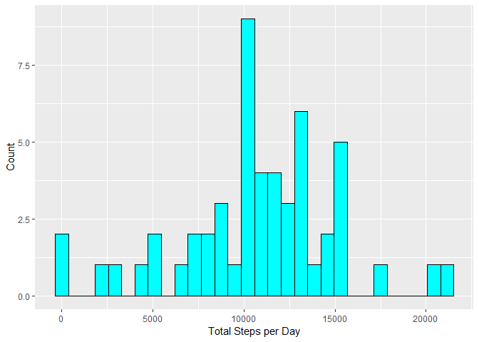
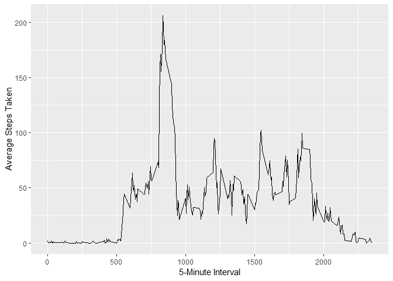
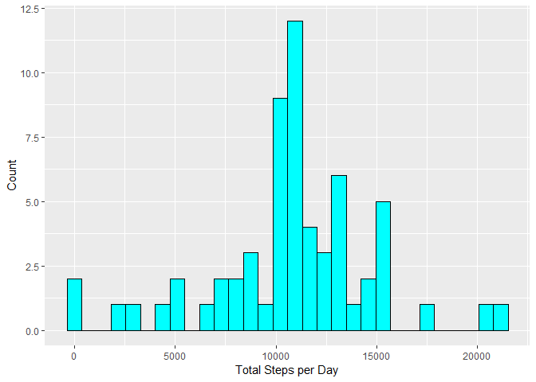
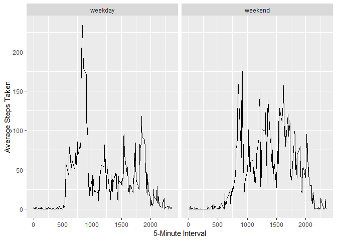

# Reproducible Research: Assignment 1
### Isabella Salmi, 2/20/19  
  
  
  
### Assumptions

In order for this file to knit correctly, the code must be run in a working directory that contains a "data" folder holding the "activity.csv" file

### Loading and preprocessing the data

1. Load the data

```r
# initialize all the libraries we will need for this report
suppressMessages(library(lubridate))
suppressMessages(library(dplyr))
suppressMessages(library(ggplot2))

file <- "data/activity.csv"
data <- read.csv(file, header = TRUE)
```

2. Process/transform the data

```r
data$date <- ymd(data$date)
```

### What is the mean total number of steps taken per day?

1. Calculate the total number of steps taken per day

```r
d2 <- data %>%
    group_by(date) %>%
    summarize(total_steps = sum(steps), na.rm = TRUE)
```

2. Make a histogram of the total number of steps taken each day

```r
ggplot(d2, aes(x=total_steps)) +
    geom_histogram(bins = 30, fill = "cyan", color = "black") +
    labs(x = "Total Steps per Day", y = "Count")
```

```
## Warning: Removed 8 rows containing non-finite values (stat_bin).
```

<!-- -->

3. Calculate and report the mean and median of the total number of steps taken per day  

The mean number of steps per day is:

```r
mean(d2$total_steps, na.rm = TRUE)
```

```
## [1] 10766.19
```
  
The median number of steps per day is:

```r
median(d2$total_steps, na.rm = TRUE)
```

```
## [1] 10765
```

### What is the average daily activity pattern?
1.Make a time series plot of the 5-minute interval and the average number of steps taken, averaged across all days.

```r
d3 <- data %>%
    group_by(interval) %>%
    summarize(mean_steps = mean(steps, na.rm = TRUE))

ggplot(d3, aes(x = interval, y = mean_steps)) +
    geom_line() +
    labs(x = "5-Minute Interval", y = "Average Steps Taken")
```

<!-- -->

2.Which 5-minute interval, on average across all days, contains the maximum number of steps?

```r
d3$interval[which.max(d3$mean_steps)]
```

```
## [1] 835
```

### Imputing missing values
1. Calculate and report the total number of missing values in the dataset.

```r
nas <- is.na(data$steps)
sum(nas)
```

```
## [1] 2304
```

2. Devise a strategy for filling in all of the missing values in the dataset.  

Strategy: fill in missing values with the average steps for that 5-minute interval across all non-missing data. 


3. Create a new dataset that is equal to the original dataset but with the missing data filled in. 

```r
interval_means <- data %>%
    group_by(interval) %>%
    summarize(mean_steps = mean(steps, na.rm = TRUE))

d4 <- data
for (i in 1:nrow(d4)){
    if (is.na(d4[i,1])){
        int <- d4[i,3]
        d4[i,1] <- filter(interval_means, interval == int)$mean_steps
    } 
}
```

4. Make a histogram of the total number of steps taken each day. Calculate and report the mean and median total number of steps taken per day. Do these values differ from the estimates from the first part of the assignment? What is the impact of imputing missing data on the estimates of the total daily number of steps?

```r
d5 <- d4 %>%
    group_by(date) %>%
    summarize(total_steps = sum(steps))

ggplot(d5, aes(x=total_steps)) +
    geom_histogram(bins = 30, fill = "cyan", color = "black") +
    labs(x = "Total Steps per Day", y = "Count")
```

<!-- -->

```r
mean(d5$total_steps)
```

```
## [1] 10766.19
```

```r
median(d5$total_steps)
```

```
## [1] 10766.19
```

Imputing the missing values based on average step counts for the same time interval had very little effect on the mean and median daily step counts. This is likely because most missing values occurred in chunks that encompassed a whole day. Thus, imputing based on averages meant that were were even more days clustered around the average total step count. We can see this effect in the histogram, which is very similar to the original histogram, but has more cases in the median ranges. 

### Are there differences in activity patterns between weekdays and weekends?
1. Create a new factor variable for the dataset with two levels - "weekday" and "weekend" indicating whether a given date is a weekday or weekend day. 

```r
d6 <- mutate(data, day_type = weekdays(date) %in% c("Saturday", "Sunday"))
d6$day_type <- as.factor(d6$day_type)
levels(d6$day_type) <- c("weekday", "weekend")
```

2. Make a panel plot containing the time series plot of the 5-minute interval and the average number of steps taken, averaged across all week or weekend days. 

```r
d7 <- d6 %>%
    group_by(day_type, interval) %>%
    summarize(mean_steps = mean(steps, na.rm = TRUE))

ggplot(d7, aes(x = interval, y = mean_steps)) +
    geom_line() +
    facet_wrap(~day_type) +
    labs(x = "5-Minute Interval", y = "Average Steps Taken")
```

<!-- -->
